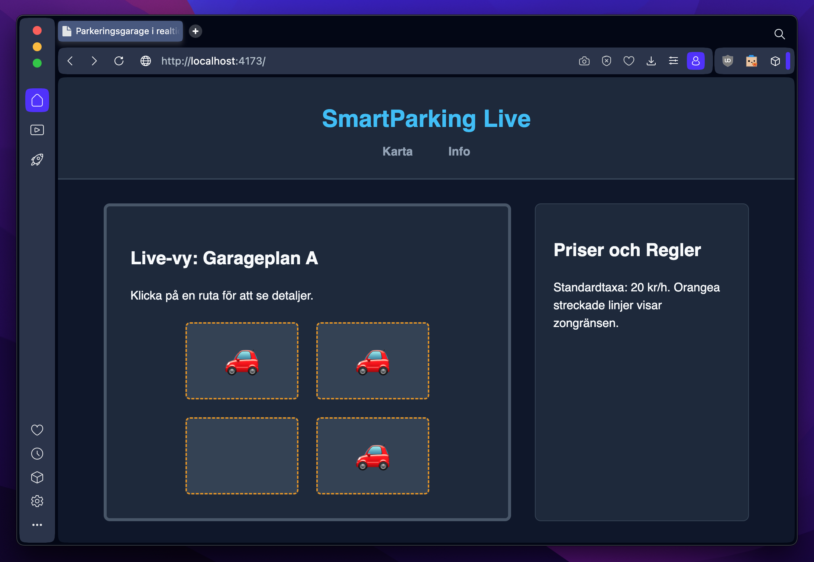

# Exercise 3: "The Digital Parking Garage" (a11y)

**Program:** Lexicon / LTU (VT-2026)  
**Course:** HTML / CSS  
**Tags:** `a11y` `accessibility` `html5` `css3` `autoprefixer` `wcag` `seo`

---

## Project Purpose
The purpose of this project is to optimize an interactive parking lot dashboard for full accessibility (a11y), search engine optimization (SEO), and general web best practices. By refactoring a legacy codebase into semantic HTML5, implementing WAI-ARIA attributes, and ensuring compliant color contrast ratios, the application achieves a perfect score in quality assurance audits without compromising the visual layout. The final implementation ensures that the live-map interface is completely machine-readable and keyboard-navigable.

## Core Technologies
* **HTML5:** Semantic elements (`<button>`, `<main>`, `<section>`) and WAI-ARIA attributes (`aria-label`, `aria-hidden`, `role="img"`) for screen reader compatibility.
* **Stylus / CSS3:** Responsive styling, custom theme inheritance for text contrast, and dedicated accessibility focus indicators (`:focus-visible`).
* **Vite:** Local development server and build tool bundling the assets.
* **Lighthouse**: Auditing tool used in the browser to verify performance, accessibility, best practices, and SEO compliance during development.

## Project Structure

The project source code lives in the `src/` directory, while the production-ready assets are generated inside the `dist/` folder.

    /root
      ├── dist/                 # Generated upon production build (tracked in .gitignore)
      ├── docs/                 # Assignment documentation and PDFs
      │   ├── benchmarks/       # Auditing reports and performance data
      │   │   └── lighthouse.png
      │   ├── examples/         # Reference implementations and boilerplate blueprints
      │   │   ├── wcag_seo_good.css
      │   │   └── wcag_seo_good.html
      │   ├── exercise/         # Assignment requirements and guidelines
      │   │   ├── exercise-03-a11y.pdf
      │   │   ├── exercise-03.css
      │   │   └── exercise-03.html
      │   └── theory/           # Educational background material
      │       ├── aria.pdf
      │       ├── lighthouse.pdf
      │       └── wcag-seo.pdf
      ├── node_modules/         # Installed dependencies
      ├── src/                  # Source files (Vite root)
      │   ├── assets/
      │   │   ├── scripts/      # JavaScript files
      │   │   │   └── main.js
      │   │   └── styles/       # Stylus stylesheets
      │   │       └── main.styl
      │   ├── public/           # Static assets copied directly to dist root
      │   │   └── robots.txt
      │   └── index.html        # Main HTML entry point
      ├── .browserslistrc       # Target browsers configuration for Autoprefixer
      ├── .gitignore
      ├── package-lock.json
      ├── package.json
      ├── postcss.config.js     # PostCSS configuration (Autoprefixer)
      ├── preview.png           # Project screenshot for repository overview
      ├── README.md             # Project documentation
      └── vite.config.js

## Getting Started

Follow these steps to install the necessary dependencies and run the project locally.

### 1. Install Dependencies
Before running the project for the first time, install all required packages (including Vite, Stylus, and Autoprefixer):

    npm install

### 2. Start the Development Server
To launch the local development server with Hot Module Replacement (HMR), run:

    npm run dev

Click the `http://localhost:5173` link displayed in your terminal to open the project in your browser. Any changes made to the source files will reflect instantly without requiring a manual page reload.

### 3. Build for Production
When the project is complete and ready for deployment, generate the optimized, minified, and prefixed production assets by running:

    npm run build

The compiled files will be outputted to the `dist/` directory.

### 4. Preview the Production Build
To verify that the production build in the `dist/` directory works exactly as expected before deploying, you can spin up a local preview server:

    npm run preview